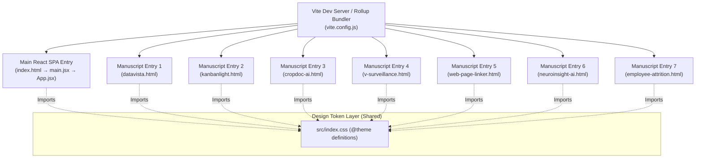

# Project Architecture & Deep Technical Walkthrough
**Vardaan Bajaj — Digital Manuscript Library & Research Archive**

This document provides a comprehensive, highly descriptive walkthrough of the entire project codebase. It explains how each architectural layer, file, component, design token, and build script functions and relates to one another—both technically and philosophically.

---

## 🏛️ 1. Core Philosophy: "A Scholar's Approach to Modern Systems"

Most modern developer portfolios are built as bloated Single Page Applications (SPAs) or standard dark-mode landing pages with saturated primary colors (cyan, electric blue, bright neon). 

This project intentionally rejects that convention in favor of **"A Scholar's Digital Library & Manuscript Archive"**.

### Theoretical & Design Foundations
1. **Classical Aesthetic Metaphor**: The interface mirrors a leather-bound, dark walnut library at night under a warm banker's lamp.
   * **Walnut (`#100b08`)**: Represents deep wood bookshelves and desk surfaces.
   * **Gold (`#c5a880`)**: Represents gilded serif typography and brass library accents.
   * **Copper (`#c2845b`)**: Represents active copper filaments, draft statuses, and mechanical precision.
   * **Forest (`#0c120c`)**: Represents completed research and steady academic production.
   * **Parchment (`#fbf9f4`)**: Represents aging manuscript pages and legible reading text.

2. **Tactile Atmospheric Physics**: Rather than static flat colors, the site utilizes an atmospheric rendering pipeline consisting of:
   * Ambient SVG noise grain (`mix-blend-overlay`).
   * Multi-layered radial CSS blurs simulating soft lamp lighting.
   * Fine serif typography ([`Cormorant Garamond`](https://fonts.google.com/specimen/Cormorant+Garamond)) for headings and sans-serif ([`DM Sans`](https://fonts.google.com/specimen/DM+Sans)) for technical metadata.

3. **Performance & Modular Wisdom**: Heavy, text-dense case studies and multi-page IEEE paper breakdowns are **decoupled** from the main React bundle. They live as zero-JS / lightweight standalone HTML manuscripts, ensuring instantaneous load times (<4kB gzipped) without requiring clients to parse massive single-bundle JavaScript trees.

---

## 🌐 2. Multi-Page Architecture & Build Flow

The project employs a **Hybrid Multi-Page Application (MPA) Architecture** orchestrated by Vite and Rollup.



### Build Orchestration in [`vite.config.js`](file:///home/vardaanbazaz/Git%20Projects/vardaan-bajaj/vite.config.js)
```javascript
export default defineConfig({
  plugins: [react(), tailwindcss()],
  build: {
    rollupOptions: {
      input: {
        main: resolve(__dirname, 'index.html'),
        datavista: resolve(__dirname, 'datavista.html'),
        kanbanlight: resolve(__dirname, 'kanbanlight.html'),
        cropdoc: resolve(__dirname, 'cropdoc-ai.html'),
        neuroinsight: resolve(__dirname, 'neuroinsight-ai.html'),
        neurosight: resolve(__dirname, 'neurosight-ai.html'),
        attrition: resolve(__dirname, 'employee-attrition.html'),
        linker: resolve(__dirname, 'web-page-linker.html'),
        surveillance: resolve(__dirname, 'v-surveillance.html'),
      },
    },
  },
});
```

* **Why this matters**: Rollup treats each HTML document as an independent root entry point. When compiled, Vite generates separate, optimized HTML pages in `/dist`, shared CSS chunks, and isolated JS bundles.
* **Shared Tailwind v4 Tokens**: All standalone HTML manuscripts link directly to `<link rel="stylesheet" href="/src/index.css" />`. Vite processes the `@theme` definitions and outputs a single CSS stylesheet shared by both the React SPA and the static HTML case studies.

---

## 📂 3. Comprehensive Codebase & Directory Structure

```text
/home/vardaanbazaz/Git Projects/vardaan-bajaj/
├── index.html                  # Main SPA entry point
├── datavista.html              # Standalone Manuscript: Browser BI Engine
├── kanbanlight.html            # Standalone Manuscript: Distributed State Kanban
├── cropdoc-ai.html             # Standalone Manuscript: CV Inference Service
├── v-surveillance.html         # Standalone Manuscript: IEEE Drone Surveillance Paper
├── web-page-linker.html        # Standalone Manuscript: IEEE Web Linker Paper
├── neuroinsight-ai.html        # Standalone Manuscript: Parkinson's Acoustic ML Research
├── employee-attrition.html     # Standalone Manuscript: HR Analytics Engine
├── vite.config.js              # Multi-page build configuration
├── package.json                # Project dependencies & scripts
├── README.md                   # System documentation
└── src/
    ├── main.jsx                 # React root renderer
    ├── App.jsx                  # Main SPA layout orchestrator
    ├── index.css                # Tailwind CSS v4 design tokens & custom utilities
    ├── components/              # Atomic UI components
    │   ├── GrainOverlay.jsx      # Atmospheric SVG noise & CSS blur lighting
    │   ├── DecorativeBorder.jsx  # Diamond-embossed horizontal section dividers
    │   ├── SectionContainer.jsx  # Framer Motion scroll-reveal container
    │   └── Card.jsx              # Wood-shadow bordered card primitive
    └── sections/                # Functional content sections
        ├── Hero.jsx              # Monogram, title header, CTA links, scroll cue
        ├── About.jsx             # Identity statement & 3 core engineering pillars
        ├── FeaturedWork.jsx      # Flagship project cards linking to manuscripts
        ├── Experience.jsx        # DRDO / AgryBin timeline & IEEE publications
        ├── CurrentlyBuilding.jsx # Active engineering builds (KanbanLight, CropDoc)
        └── Contact.jsx           # Correspondence channels & copyright footer
```

---

## 🔗 4. How Component & Code Layers Relate

### A. Design System Layer ([`src/index.css`](file:///home/vardaanbazaz/Git%20Projects/vardaan-bajaj/src/index.css))
* Defines CSS variables using Tailwind v4 `@theme` directive (`--color-walnut-*`, `--color-gold-*`, `--color-copper-*`, `--color-forest-*`, `--color-parchment-*`).
* Implements custom scrollbar styles, wood drop shadows (`.wood-shadow`), subtle keyframe animations (`subtle-drift`, `soft-pulse`), and font bindings (`--font-serif`, `--font-sans`).

### B. Structural Component Layer ([`src/components/`](file:///home/vardaanbazaz/Git%20Projects/vardaan-bajaj/src/components))
1. **[`GrainOverlay.jsx`](file:///home/vardaanbazaz/Git%20Projects/vardaan-bajaj/src/components/GrainOverlay.jsx)**:
   * Rendered once at the root of [`App.jsx`](file:///home/vardaanbazaz/Git%20Projects/vardaan-bajaj/src/App.jsx) (and inline in static HTML pages).
   * Renders a fixed 1.5% opacity noise grain over the viewport using `mix-blend-overlay`.
   * Positions three fixed radial blurs with keyframe drift animations to simulate banker's lamp highlights across the dark background.
2. **[`SectionContainer.jsx`](file:///home/vardaanbazaz/Git%20Projects/vardaan-bajaj/src/components/SectionContainer.jsx)**:
   * Wraps all content sections (`<Hero>`, `<About>`, `<FeaturedWork>`, etc.).
   * Integrates Framer Motion `motion.section` with `whileInView` triggers to smoothly fade and slide sections upward as the user scrolls down the library scrollway.
3. **[`Card.jsx`](file:///home/vardaanbazaz/Git%20Projects/vardaan-bajaj/src/components/Card.jsx)**:
   * Standardizes the dark-walnut glass surface (`bg-walnut-900/40`), fine gold borders (`border-gold-500/10`), and soft inset wood shadows (`wood-shadow`).
   * Provides subtle hover elevation (`hover:-translate-y-0.5`).
4. **[`DecorativeBorder.jsx`](file:///home/vardaanbazaz/Git%20Projects/vardaan-bajaj/src/components/DecorativeBorder.jsx)**:
   * Acts as a visual chapter mark between sections.
   * Features gradient lines fading outward with a central 45-degree diamond SVG node in copper.

### C. SPA Section Layer ([`src/sections/`](file:///home/vardaanbazaz/Git%20Projects/vardaan-bajaj/src/sections))
1. **[`Hero.jsx`](file:///home/vardaanbazaz/Git%20Projects/vardaan-bajaj/src/sections/Hero.jsx)**:
   * Acts as the title leaf of the digital manuscript.
   * Contains the "VB" monogram seal, main header typography, core tagline, and key call-to-action buttons (Resume, GitHub, Publications, Contact).
2. **[`About.jsx`](file:///home/vardaanbazaz/Git%20Projects/vardaan-bajaj/src/sections/About.jsx)**:
   * Articulates the engineering philosophy in the left column.
   * Highlights three structural pillars on the right: Core Systems Engineering, Applied AI & Computer Vision, and Long-Term Technical Vision.
3. **[`FeaturedWork.jsx`](file:///home/vardaanbazaz/Git%20Projects/vardaan-bajaj/src/sections/FeaturedWork.jsx)**:
   * Displays flagship completed systems (DataVista, NeuroInsight AI, Employee Attrition).
   * Each card links directly to its respective standalone HTML manuscript (e.g. `/datavista.html`).
4. **[`Experience.jsx`](file:///home/vardaanbazaz/Git%20Projects/vardaan-bajaj/src/sections/Experience.jsx)**:
   * **Chronology of Practice**: Timeline of roles (DRDO, AgryBin, Mahyco, University of Jammu) detailing signal processing, radar DSP, computer vision, and backend systems.
   * **Academic Contributions**: Peer-reviewed publication cards linking to IEEE paper manuscripts ([`web-page-linker.html`](file:///home/vardaanbazaz/Git%20Projects/vardaan-bajaj/web-page-linker.html) and [`v-surveillance.html`](file:///home/vardaanbazaz/Git%20Projects/vardaan-bajaj/v-surveillance.html)).
5. **[`CurrentlyBuilding.jsx`](file:///home/vardaanbazaz/Git%20Projects/vardaan-bajaj/src/sections/CurrentlyBuilding.jsx)**:
   * Showcases active engineering projects (KanbanLight, CropDoc AI).
   * Features active pulsing copper badges (`animate-pulse`) representing active development status.
6. **[`Contact.jsx`](file:///home/vardaanbazaz/Git%20Projects/vardaan-bajaj/src/sections/Contact.jsx)**:
   * Provides direct channels for academic and engineering correspondence (Email, LinkedIn, GitHub).
   * Concludes with the signature copyright seal: *"Handcrafted with intent • Vardaan Bajaj"*.

---

## 🔬 5. Summary of Key Technological Decisions

| Component / File | Technology / Approach | Rationale |
| :--- | :--- | :--- |
| **Routing Architecture** | Hybrid Multi-Page (Vite + Rollup `input`) | Allows light React SPA landing while deep case studies load independently as fast static HTML pages. |
| **Styling System** | Tailwind CSS v4 `@theme` | Direct token definition for Walnut, Gold, Copper, and Parchment color palettes without legacy config files. |
| **Animation Engine** | Framer Motion & CSS Keyframes | Smooth scroll-triggered reveal effects (`whileInView`) for sections and ambient lighting drift animations. |
| **Atmosphere Simulation** | Inline SVG Grain + Backdrop Blurs | Replaces flat modern web aesthetics with tactile paper texture and warm scholar's library lighting. |
| **Manuscript Integration** | Rollup Multi-Entry HTML | Keeps deep-dive technical research easily shareable, highly indexable, and performant. |

---

## 🎯 Verification & Health Status
* Multi-entry Rollup compilation tested cleanly (`npm run build`).
* Tailwind v4 CSS token mapping verified across both React components and static `.html` manuscripts.
* Page hierarchy and link connections fully integrated.
