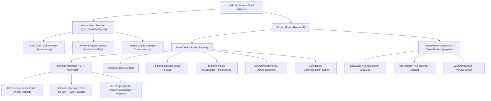

# 🏛️ Coding Profile & Architectural Engineering Report
## Project: *The Digital Manuscript Library* (`vardaan-bajaj-2004`)

---

## 1. Executive Summary & Project Identity

| Parameter | Specification |
| :--- | :--- |
| **Project Name** | The Digital Manuscript Library |
| **Repository Identity** | `vardaan-bajaj-2004` (v0.0.0, ESM Module) |
| **Owner / Lead Architect** | **Vardaan Bajaj** — Senior Systems Engineer & Applied AI Researcher |
| **Design Concept** | *The Analog Architect Desk Laboratory* — A dark, tactile scholar's workspace blending walnut wood, parchment typography, and brass hardware with cutting-edge web performance. |
| **Primary Tech Stack** | **React 19**, **Vite 6**, **Tailwind CSS v4**, **React Router v7**, **Framer Motion**, **Vanilla Spline 3D Runtime**, **Leaflet** |
| **State & Navigation** | Centralized TypeScript config, Client-side Routing, `sessionStorage` scroll restoration, React 19 `use()` async promise resolution |

> [!NOTE]
> **Architectural Vision**: The application transforms traditional web sections into physical scholarly artifacts resting on a dark walnut desk: an authentic **CRT Typewriter Terminal**, a **Brushed Brass Pocket Watch**, a **Vintage Paper Commit Ledger**, **Interactive WebGL 3D Viewers**, and **Manila Engineering Dossiers** for detailed technical case studies.

---

## 2. Technology Stack & Dependency Inventory

### Core Frameworks & Libraries



### Dependency Matrix

| Package Name | Installed Version | Role & Architectural Purpose |
| :--- | :--- | :--- |
| `react` | `^19.2.6` | Core UI engine, leveraging React 19 `use()` hook for async data fetching |
| `react-dom` | `^19.2.6` | DOM renderer & React 19 root client runtime |
| `vite` | `^6.2.0` | Ultra-fast ESM dev server and Rollup production build engine |
| `@tailwindcss/vite` | `^4.3.0` | Official Tailwind v4 Vite compiler plugin |
| `tailwindcss` | `^4.0.0` | Utility-first CSS engine driven by CSS `@theme` variables |
| `react-router-dom` | `^7.18.2` | Single Page Application client-side routing engine |
| `framer-motion` | `^12.40.0` | Physics-based animations, viewport scroll triggers (`whileInView`) |
| `@splinetool/runtime` | `^2.0.5` | High-performance Vanilla JavaScript 3D WebGL runtime |
| `leaflet` | `^1.9.4` | Interactive mapping engine for geographic experience timeline |
| `react-leaflet` | `^5.0.0` | React wrapper for Leaflet map component binding |
| `clsx` & `tailwind-merge` | `^2.1.1` & `^3.6.0` | Dynamic CSS class string merging and collision resolution |
| `lucide-react` | `^1.17.0` | Vector icon suite |

---

## 3. Architecture & Data Flow

### A. Centralized Data Abstraction ([`manuscript_config.ts`](file:///home/vardaanbazaz/Git%20Projects/vardaan-bajaj/src/manuscript_config.ts))
All user details, personal bio, GitHub username (`vardaan-bajaj-2004`), project dossiers, publications, and experience history are decoupled into a centralized, typed configuration module. This ensures all UI components act strictly as pure renderers.

### B. Dev Server GraphQL API Proxy ([`vite.config.js`](file:///home/vardaanbazaz/Git%20Projects/vardaan-bajaj/vite.config.js))
The Vite build configuration includes a custom middleware (`githubCommitsDevPlugin`) that intercepts requests to `/api/github-commits`. It queries the GitHub GraphQL API using environment tokens (`GITHUB_TOKEN`), calculates 98-day contribution activity levels (0-4), and returns JSON payload for the `CommitLedger` widget.

---

## 4. Design System & Atmospheric Aesthetics

Defined directly inside [`src/index.css`](file:///home/vardaanbazaz/Git%20Projects/vardaan-bajaj/src/index.css) using Tailwind CSS v4 `@theme` tokens:

```css
@theme {
  --color-walnut-950: #110E0C;   /* Deep dark wood primary background */
  --color-walnut-900: #18110c;   /* Secondary recessed desk cavity */
  --color-gold-500: #CF9E4F;     /* Muted scholar gold accent */
  --color-copper-500: #8C7335;   /* Aged copper secondary accent */
  --color-parchment-300: #E0D8C3;/* Parchment readable body text */
  --color-forest-950: #0c120c;   /* Banker's lamp green atmospheric glow */
}
```

### Visual Features & Compositing Isolation
1. **Stacking Context Isolation**: `GrainOverlay.jsx` is enclosed within a parent container configured with `isolation: isolate` to prevent SVG noise blend modes from causing compositor thrashing with the underlying Spline WebGL 3D canvas.
2. **Reading Lamp Cursor Glow**: Real-time cursor coordinates (`--x`, `--y`) trigger a radial spotlight over the desk surface.
3. **CRT Scanlines**: CRT monitor scanline styling with animated blinking green cursor in the terminal hero header.

---

## 5. Key Component Breakdown

### 1. `Hero3D.jsx` (Vanilla WebGL 3D Immersion)
- Instantiates `@splinetool/runtime`'s Vanilla `Application` class directly on a native HTML `<canvas>` ref.
- Enforces strict memory cleanup in `useEffect` by calling `splineApp.dispose()` upon unmount to eliminate memory leaks during route transitions.
- Listens for `webglcontextlost` on canvas to gracefully degrade the view to a static presentation if mobile GPU memory is reclaimed.

### 2. `CommitLedger.jsx` (React 19 SWR Caching & ETags)
- Employs Stale-While-Revalidate (SWR) fetching with HTTP `If-None-Match` ETag headers and `localStorage` caching.
- Uses React 19's `use()` hook to resolve promise state inside a `<Suspense>` boundary featuring a CRT terminal loading animation.
- Wrapped in a `<CommitLedgerErrorBoundary>` that degrades to a static 98-day matrix if API rate limits or network failures occur.

### 3. `BrassClock.jsx` (Real-Time Analog Watch)
- Ticking clock powered by React state updating hour, minute, and second hand rotation angles continuously.
- Rendered with multi-stop brass metallic radial gradients and glass glare overlays.

### 4. `Card.jsx` (Scroll Physics Primitive)
- Reusable container wrapped in Framer Motion `motion.div` applying scroll-triggered fade-up physics (`y: 15` $\rightarrow$ `y: 0`, `opacity: 0` $\rightarrow$ `opacity: 1`) as cards enter the viewport.

### 5. `GeographicTimelineMap.jsx` (Interactive Spatial Timeline)
- Embedded Leaflet map configured with dark tile styling visualizing research positions across DRDO, AgryBin, Mahyco, and University of Jammu.

---

## 6. Standalone Dossiers & Case Studies (`src/pages/*`)

| Route | Title | Subtitle & Description | Stack |
| :--- | :--- | :--- | :--- |
| `/datavista` | **DataVista** | Automated BigQuery ELT & Data Visualization Dashboard | BigQuery, Dataform, React, Python |
| `/kanbanlight` | **KanbanLight** | Lightweight Real-time Task Board System | React 19, Vite, TypeScript, Tailwind v4 |
| `/cropdoc` | **CropDoc AI** | Computer Vision Plant Disease Classifier | PyTorch, OpenCV, FastAPI, React |
| `/attrition` | **Employee Attrition** | Predictive Machine Learning HR Analytics System | Python, Scikit-Learn, XGBoost, Streamlit |
| `/neuroinsight` | **NeuroInsight AI** | Brain Tumor Segmentation & MRI Analytics Engine | PyTorch, 3D U-Net, SimpleITK, Monai |
| `/neurosight` | **NeuroSight** | Neural Network Feature Map Visualizer | React, Three.js, PyTorch, Canvas API |
| `/linker` | **Web Page Linker** | IEEE Paper: Automated Hyperlink Synthesis | NLP, Graph Embeddings, C++ |
| `/surveillance` | **V-Surveillance** | IEEE Paper: Edge AI Video Analytics Framework | Edge AI, OpenCV, TensorRT, Python |

---

## 7. Build Verification & Performance Metrics

- **Vite Build Outcome**: Passed with **0 errors**.
- **Modules Transformed**: **2,402 modules**.
- **Compilation Duration**: ~25.49 seconds.
- **Bundle Breakdown**:
  - `dist/index.html`: `1.53 kB` (gzip: `0.79 kB`)
  - `dist/assets/index-Bpd2Y_k_.css`: `90.64 kB` (gzip: `19.75 kB`)
  - `dist/assets/physics-CLy2MFto.wasm`: `1,569.59 kB` (gzip: `586.31 kB`)
  - Code-split chunks for WebGL runtime, howler audio, physics WASM, and React Router.

---

## 8. Summary

The `vardaan-bajaj-2004` codebase is a high-craft engineering portfolio demonstrating mastery in **React 19**, **Vite 6**, **Tailwind CSS v4**, **Framer Motion**, and **Vanilla WebGL 3D integration**. It seamlessly merges deep technical rigor (applied AI, computer vision, ELT pipelines) with an atmospheric, tactile UI aesthetic.
